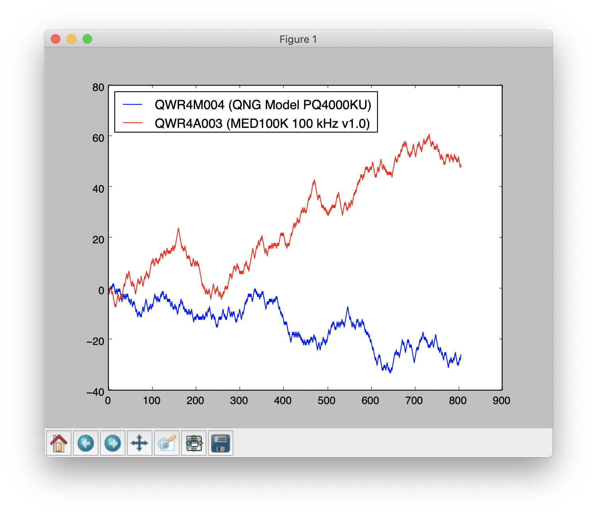

# MeterFeeder & Parking Warden

**MeterFeeder** is a C++ driver library that allows you to read in random bytes simultaneously from [Core Invention](https://coreinvention.com/)'s MED (Mind-Enabled Drive) quantum random number generator USB devices. Read the comment in generator.h for more of a description or MED_DEVICES.md for a list of the different type of MED devices available.

**Parking Warden** is a work-in-progress (consider it in beta) Python wrapper around MeterFeeder library that graphs the output of these devices. The objective of this tool is to be able to compare the responsiveness of multiple types of MED devices in an MMI (mind/matter interaction) context.

## Dependencies

Some environment details of machines where meterfeeder/parkingwarden has been reported to successfully build and run:

### MacOS

```
OS X: 10.15.7
Apple clang version 12.0.0 (clang-1200.0.32.21)
Python: tested with 2.7.16 and 3.8.2
Visual Studio Code: 1.49.3 with the various C++ development plugins installed
```

### Windows 10+

```
Windows 10 64-bit
Python: 3.9.0
Visual Studio: Community 2019 (16.0.30804.86 D16.8)
Compiler: cl /version
    Microsoft (R) C/C++ Optimizing Compiler Version 19.28.29335 for x64 
    Microsoft (R) Incremental Linker Version 14.28.29335.0
```

### Linux

```bash
Ubuntu 22.04.1:
$ sudo apt install build-essential make libusb-1.0-0 libusb-1.0-0-dev python3
```

## Virtual Com Port Conflict

### Windows

On some Windows 10 machines meterfeeder returns "no generators" even when you have them plugged in. The reason for this is that Windows automatically binds the devices to a VCP driver. It can be resolved by right-clicking and choosing "Install" for the `ftdiport.inf` and `ftdibus.inf` files that come with the FTD2XX drivers (see inside the `ftd2xx` folder).

### Linux

On Linux meterfeeder returns "no generators" even when you have them plugged in. The reason for this is that the kernel automatically binds the devices to a VCP driver called `ftdi_sio`. It can be resolved by either following official FT recommendations of disabling the VCP kernel module using this command:

```bash
$ sudo rmmod ftdi_sio
$ sudo rmmod usbserial
```

This brute solution might get you into trouble with other devices needing thje kernel's automatic VCP functionality. A more elegant solution is running the provided script that creates a udev rule and a helper script to automatically unbind MEDs from `ftdi_sio` and makes them visible to the FTD2XX driver underlying meterfeeder.

```bash
$ ./linux-setup-udev.sh
```

To remove the udev rule and helper script simply run `./linux-remove-udev.sh`.

## To build just MeterFeeder and a basic binary to read in random byte numers (unsigned char type):

### On a Mac

Assuming you've got libusb 1.0.26 installed (with brew etc.) and have plugged in your USB MED devices:

```bash
$ ./mac-build-exe.sh 
$ ./builds/mac/meterfeeder
QWR4A003 (MED100K 100 kHz v1.0): 92
QWR4M004 (QNG Model PQ4000KU): 153
```

### On Windows

```bash
C:\>win-build-executable.bat
C:\>builds\windows\meterfeeder.exe
QWR4A003 (MED100K 100 kHz v1.0): 92
QWR4M004 (QNG Model PQ4000KU): 153
```

##### If trying to build meterfeeder.dll:
```
Add C:\Program Files (x86)\Microsoft Visual Studio\2019\Community\VC\Auxiliary\Build to the PATH environment variable, modifying it to match your Visual Studio Code installation.
```

### On Linux

Assuming you've got libusb 1.0.0 installed and have plugged in your USB MED devices:

```bash
$ ./linux-build-exe.sh 
$ ./builds/linux/meterfeeder
QWR4A003 (MED100K 100 kHz v1.0): 92
QWR4M004 (QNG Model PQ4000KU): 153
```

### To run Parking Warden

```bash
$ pip install numpy matplotlib
$ ./mac-build-dylib.sh
$ python ./parking_warden/parking_warden.py
```

#### To build a self contained EXE (to run on Windows)

We found that Python 3.9 wasn't supposed on Windows 7/64-bit, so we settled for 3.8.7. You will have to get your Visual Studio environment setup properly for C++ compiling like making sure the PATH environment variable is setup correctly.

```DOS
C:>win-build-dylib.bat
C:>python builds\windows\parking_warden_setup.py py2exe
```

Copy meterfeeder.dll and ftd2xx.dll to dist\ and then run dist\parking_warden.exe.



